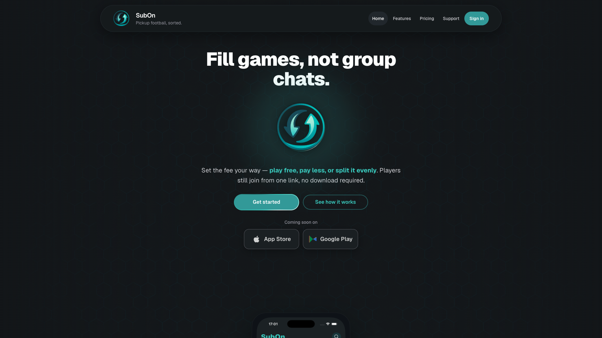
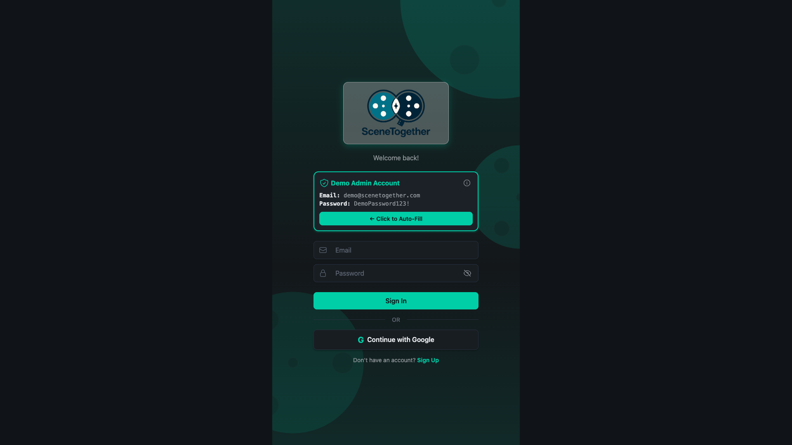
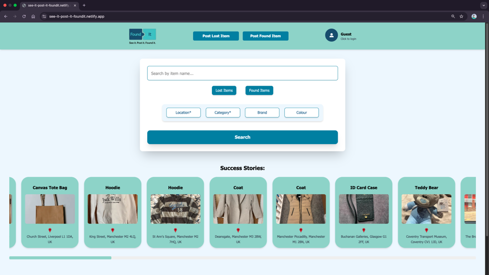

<!-- markdownlint-disable MD033 MD036 MD041 MD045 MD012 -->
<!-- Header Banner -->
<div align="center">
  
</div>

<br>

<!-- Multilingual Typing Greeting -->

<div align="center">
  
</div>

<br>

<!-- Sub-heading -->

<div align="center">
<h3>🎭 Drama Graduate → 📈 Equities Trader → 👨🏻‍💻 Technical Systems Developer & SaaS Founder</h3>
</div>

<br>

<!-- Social Links -->

<div align="center">

[](https://www.linkedin.com/in/kevin-p-stephenson/)&nbsp; [](https://kevin-stephenson.com)&nbsp; [](https://github.com/kevpstephens?tab=repositories)

</div>

<br>

<!-- Section Divider -->

<div align="center">
  
</div>

<br>

<!-- About Me Section -->

- **Currently:** Technical Systems Developer at Impacting Lives Limited - building business systems, workflow automation, and Google Apps Script solutions
- **Also building:** [SubOn](https://www.subonapp.com/) - my pickup football SaaS for organisers (Expo, Next.js, Supabase, Stripe)
- Based in Birmingham, UK 🇬🇧 · Northcoders graduate (March–June 2025)
- Former equities trader and drama graduate turned passionate developer
- I love solving real problems, shipping useful products, and learning new tech along the way
- Always open to collaboration or a chat - feel free to connect!

<br><br>

<!-- Section Divider -->

<div align="center">
  
</div>

<!-- Featured Projects Section -->

<div align="center">
<h1>📁 Featured Projects</h1>
</div>

### ⚽ [SubOn](https://www.subonapp.com/) _(in progress)_

Pickup football organiser - join via link or QR, track RSVPs and payments

<p align="center">
  <a href="https://www.subonapp.com/">
    
  </a>
</p>

- **Stack:** Expo / React Native, Next.js, Supabase, PostgreSQL, Stripe, RevenueCat
- **Monorepo:** pnpm workspaces + Turbo - native iOS/Android apps and a web layer for marketing, join/pay flows, and SubOn Pro billing
- **Features:** Share join links & QR codes, squad payment tracking, team creation, push notifications, and deep linking
- 🔗 [Live Site](https://www.subonapp.com/) | [Web App](https://sub-on-web.vercel.app)

### 🎬 [SceneTogether](https://scenetogether.netlify.app/)

Community platform for discovering and attending local film screenings

<p align="center">
  <a href="https://scenetogether.netlify.app/">
    
  </a>
</p>

<div align="center">
  <a href="https://github.com/kevpstephens/scene-together">
    
  </a>
</div>

- **Commissioned project** for Tech Returners - cross-platform on iOS, Android, and web
- **Stack:** Expo / React Native, Express.js, Prisma, PostgreSQL, Supabase Auth, TMDB, Stripe
- **Features:** Browse screenings with movie data, one-tap RSVP, calendar sync, admin dashboard, and flexible ticketing (free, fixed, pay-what-you-can)
- 🔗 [Live Demo](https://scenetogether.netlify.app/) | [GitHub Repo](https://github.com/kevpstephens/scene-together)

### 🔍 [FoundIt](https://see-it-post-it-foundit.netlify.app/)

Collaborative lost & found web application

<p align="center">
  <a href="https://see-it-post-it-foundit.netlify.app/">
    
  </a>
</p>

- **Tech Stack:** TypeScript, Next.js, MongoDB, Socket.io, Tailwind CSS
- **Team:** Built with 6 other developers (Carly, Wan, Pourya, Ellie, Irina, Lera) using Agile methodology
- **Role:** Full-stack development, API integration, UI/UX design
- 🔗 [Live Demo](https://see-it-post-it-foundit.netlify.app) | [Team Organisation](https://github.com/Team-423) | [Backend Repo](https://github.com/Team-423/foundit-backend) | [Frontend Repo](https://github.com/Team-423/foundit-frontend)

<br><br>

<!-- Section Divider -->

<div align="center">
  
</div>

<!-- Tech Stack & Tools Section -->

<div align="center">
<h1>🛠️ Tech Stack & Tools</h1>
</div>

<br>

<div align="center">

### 💻 **Languages & Frameworks**


<br><br>

### 🗃️ **Databases & Testing**


<br><br>

### 🔧 **Tools & Development**


<br><br>

### ☁️ **Deployment & API Tools**


</div>

<br><br>

<!-- Section Divider -->

<div align="center">
  
</div>

<!-- GitHub Stats Section -->

<div align="center">
<h1>📊 GitHub Stats</h1>
</div>

<br>

<div align="center">
  
  &nbsp;
  
</div>

<br>

<div align="center">
  
</div>

<br>

<div align="center">
  
</div>

<br><br>

<br><br>

<!-- Section Divider -->

<div align="center">
  
</div>

<!-- Contact Section -->

<div align="center">
<h1>📫 Let's Connect!</h1>
</div>

<br>

I'm always interested in connecting with fellow developers, discussing new technologies, or exploring collaboration opportunities. Whether you want to chat about SubOn, business systems, full-stack architecture, or you're simply curious about any of my work and would like to say "hi" - I'd love to hear from you!

<br><br>

<!-- Social Links (Footer) -->

<div align="center">

[](https://www.linkedin.com/in/kevin-p-stephenson/)&nbsp; [](https://kevin-stephenson.com)&nbsp; [](https://github.com/kevpstephens?tab=repositories)&nbsp;

[](mailto:kevpstephenson@gmail.com)

</div>

<br><br>

<!-- Dev Joke Section - code -->

<div align="left">

```js
const probablyQuiteBadDevJoke = async () => {
  try {
    await laugh();
  } catch (e) {
    console.log("404: funny not found");
  }
};
```

</div>

<br>

<!-- Dev Joke Section - function invoked -->

<div align="center">
<details>
<summary><strong>probablyQuiteBadDevJoke()</strong></summary>
<br>

<!-- Dev Joke Section - dropdown opened -->


</details>
</div>

<br><br>

<!-- Footer Banner -->

<div align="center">
  
</div>

<br><br>

<!-- Profile Views -->

<div align="right">


</div>
